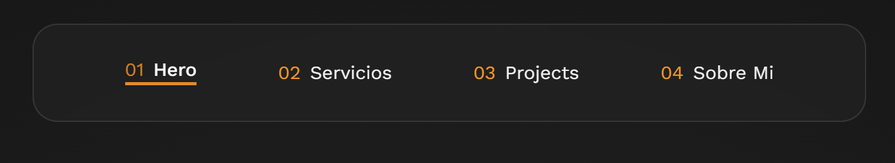
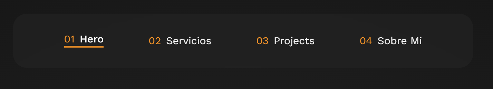
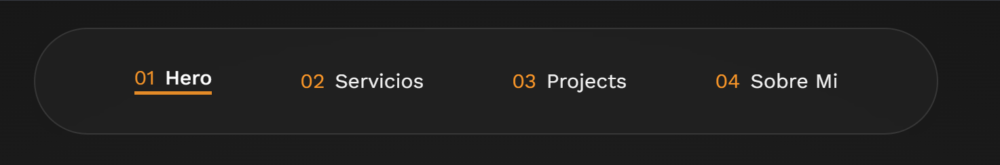

# Guía de Estilos para la Navbar

## Opciones de Border Radius

### 1. Esquinas redondeadas estándar (1rem)
**Con borde**  


**Sin borde**  


```css
.nav__content {
  border-radius: 1rem;
  /* Opcional: */
  border: 1px solid rgba(255, 255, 255, 0.1);
}
```

### 2. Forma de cápsula (9999px)
**Con borde**  


**Sin borde**  


```css
.nav__content {
  border-radius: 9999px;
  /* Opcional: */
  border: 1px solid rgba(255, 255, 255, 0.1);
}
```

## Efecto Blur y Bordes

### Efecto vidrio esmerilado
```css
.nav__content {
  backdrop-filter: blur(5px); /* Valores entre 3px-10px */
  background-color: rgba(30, 30, 30, 0.5);
}
```

**Recomendaciones:**
- Usar `blur(5px)` para equilibrio entre efecto y rendimiento
- Añadir borde cuando el contraste con el fondo sea bajo
- Considerar omitir el blur en dispositivos móviles antiguos

## Combinaciones sugeridas

1. **Estilo moderno con cápsula:**
```css
.nav__content {
  border-radius: 9999px;
  backdrop-filter: blur(8px);
  border: none;
}
```

2. **Estilo profesional con bordes sutiles:**
```css
.nav__content {
  border-radius: 0.75rem;
  backdrop-filter: blur(5px);
  border: 1px solid rgba(255, 255, 255, 0.1);
}
```